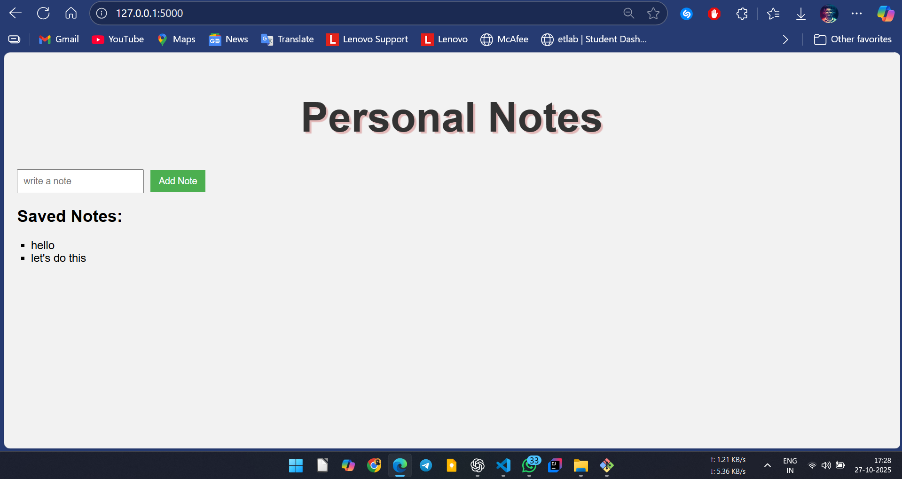

# Flask Notes App 📝

A simple web application to take personal notes, built with **Python (Flask)**, **HTML**, and **CSS**.  
Users can add notes and view them instantly.  

## Features
- Add notes  
- View saved notes  
- Delete saved notes  
- Simple user interface  

---

## 🧩 App Evolution (Development Stages)

This project went through four stages of design and functionality improvements:

### 🏁 1. Initial Version
Basic Flask structure with a simple input form and notes display.



---

### 🎨 2. New Look
Improved UI with a cleaner, more modern layout.


---

### 🗑️ 3. Delete Button Feature
Added delete functionality allowing users to remove saved notes.


---

### 🗃️ 4. With Database Integration
Integrated a database to store notes persistently instead of in-memory.


---

## 🚀 Tech Stack
- **Backend:** Flask (Python)
- **Frontend:** HTML, CSS
- **Database:** SQLite (for persistent storage)

---

## ⚙️ Setup Instructions
1. Clone the repository  
   ```bash
   git clone < https://github.com/zainkp/flask-notes-app.git>
